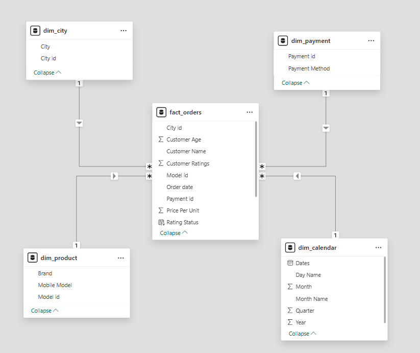
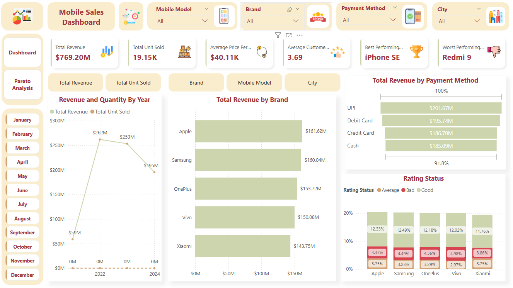
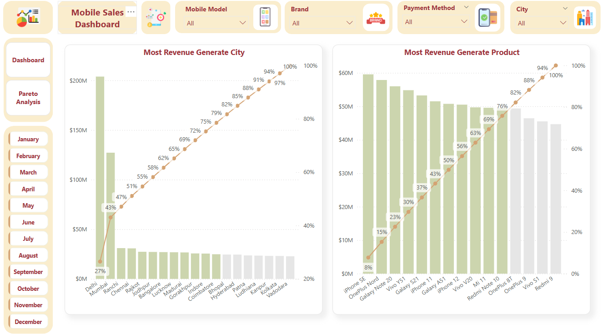

# Mobile Sales Performance Analysis - Power BI Dashboard

## 📌 Project Overview

This Power BI dashboard provides an in-depth analysis of mobile sales performance, helping business stakeholders make data-driven decisions. The dashboard covers key sales metrics, customer insights, and payment trends to optimize revenue and customer satisfaction.

## 📂 Dataset Information

### The analysis is based on an Excel dataset with the following tables:

**fact_orders:** Main transactional data, including sales revenue, units sold, customer ratings, and order details.

**dim_city:** City-related details to analyze geographic sales distribution.

**dim_payment:** Payment method details for identifying customer payment preferences.

**dim_product:** Mobile product details, including brand and model information.

## ERD (Entity Relationship Diagram) Overview



## 🎯 Problem Statement

**A mobile phone retailer wants to analyze sales performance across different cities, payment methods, and mobile brands. The goal is to gain insights into sales trends, customer preferences, and revenue generation to optimize future sales strategies.**

**Additionally, the business seeks to implement Pareto Analysis (80/20 Rule) to identify:**

**The top 20% of mobile models that contribute to 80% of total sales revenue.**

**The most profitable cities and customer segments driving the majority of revenue.**

**The payment methods that generate the highest transaction value and frequency.**

## 📊 Power BI Dashboard Features

## KPIs & Metrics:

Total Revenue, Units Sold, Average Price Per Unit

Best & Worst Performing Models (based on sales revenue and units sold)

Customer Ratings Overview (average ratings for each model)

Pareto Analysis Visualization for sales distribution

## Visualizations:

Trend charts for monthly/yearly sales

Stacked Bar Chart for sales performance by city

Bar charts comparing mobile brands & models

Funnel charts for payment method distribution

Pareto Chart to show cumulative revenue contribution by mobile models

## Interactive Filters:

Filter by City, Mobile Brand, Payment Method, and Customer Ratings

## 📈 DAX Measures I Have Used

- ### Total Revenue

```
Total Revenue = SUM(fact_orders[Sales])
```

- ### Total Unit Sold

```
Total Unit Sold = SUM(fact_orders[Units Sold])
```

- ### Average Price Per Unit

```
Average Price Per Unit = AVERAGE(fact_orders[Price Per Unit])
```

- ### Average Customer Ratings
```
Average Customer Ratings = AVERAGE(fact_orders[Customer Ratings])
```

- ### Best Performing Model

```
Best Performing Model = 
TOPN(
    1, SUMMARIZE(dim_product , dim_product[Mobile Model]) , 
    [Total Revenue] ,DESC
 )
```

- ### Worst Performing Model

```
Worst Performing Model = 
TOPN(
    1,SUMMARIZE(dim_product,dim_product[Mobile Model]) , [Total Revenue] ,ASC
    )
```

- ### Pareto Analysis For Top Mobile Model
```
Product pareto = 

VAR _rank = RANKX(ALLSELECTED(dim_product[Mobile Model]) , [Total Revenue])

VAR _fixed = CALCULATE([Total Revenue] , ALLSELECTED(fact_orders))

VAR _cum_sum = CALCULATE([Total Revenue] , TOPN(_rank , ALLSELECTED(dim_product[Mobile Model]) , [Total Revenue]))

var _cum_sum_percentage = DIVIDE(_cum_sum , _fixed)

return _cum_sum_percentage
```

- ### Pareto Analysis For Top City
```
City Pareto = 

VAR _rank = RANKX(ALLSELECTED(dim_city[City]) , [Total Revenue])

VAR _fixed = CALCULATE([Total Revenue] , ALLSELECTED(fact_orders))

VAR _cum_sum = CALCULATE( [Total Revenue] , TOPN( _rank , ALLSELECTED(dim_city[City]) , [Total Revenue]))

VAR _cum_sum_percentage = DIVIDE(_cum_sum , _fixed)

RETURN _cum_sum_percentage
```

## 🔑 Key Insights from the Power BI Dashboard:

### 1️⃣ Sales Performance Insights
- **Total Revenue:** **$769.20M with 19.15K** units sold.

- **Yearly Trend:** Revenue peaked at **$262M in 2022**, slightly declined to **$253M in 2023**, and further dropped to **$195M in 2024**.

- **Top-Selling Brands:**
 **Apple** leads with **$161.62M**, closely followed by **Samsung ($160.04M)**, **OnePlus ($153.72M)**, **Vivo ($150.08M)**, and **Xiaomi ($143.75M)**.

- **Best Performing Model:** iPhone SE.

- **Worst Performing Model:** Redmi 9.


### 2️⃣ Payment Method Analysis
  - **Most Preferred Payment Methods (by Revenue):**

    - **UPI ($201.67M) is the most used payment method**, followed by Debit Cards ($195.74M), Credit Cards ($186.70M), and Cash ($185.09M).

    - **UPI contributes ~26% of total revenue**, making it the most significant payment method for transactions.

### 3️⃣ Customer Ratings & Satisfaction

- **Average Customer Rating:** **3.69/5** across all models.

### 4️⃣ Pareto Analysis (80/20 Rule)
- **Revenue Distribution by City:**
Top 3 cities **(Delhi, Mumbai, Ranchi) contribute 47%** of total revenue.
Top 8 cities together contribute 80% of total revenue, validating the Pareto principle.

- **Revenue Distribution by Product:**
**iPhone SE, OnePlus Nord, Galaxy Note 20 , Vivo Y51, Galaxy S21 , iphone 11 and Galaxy A51 contribute** over **50%** of total revenue.

The top 20% of products contribute ~80% of total revenue, supporting the 80/20 Pareto principle.

## Business Takeaways & Recommendations
- ✅ Focus on Apple, Samsung, and OnePlus models, as they generate the highest revenue.

- ✅ Enhance marketing in top-performing cities (Delhi, Mumbai, Ranchi) to maximize sales.

- ✅ Optimize UPI payment experience, as it's the preferred method.

- ✅ Discontinue or re-evaluate underperforming models (e.g., Redmi 9)
.
- ✅ Leverage Pareto Analysis insights to focus on high-impact products and cities for better profitability.

## 🎓 What I Learned

- **Power BI & DAX:** Built interactive dashboards, applied advanced DAX measures, and optimized sales analysis.

- **Data Modeling:** Designed an efficient star schema connecting fact and dimension tables for better performance.

- **Pareto Analysis:** Identified top-performing products and cities driving 80% of revenue.

- **Data-Driven Insights:** Analyzed sales trends, customer ratings, and payment preferences to support business decisions.

- **Business Intelligence:** Transformed raw data into actionable insights for optimizing sales and revenue growth.

## Final Dashboard 





## 📢 Conclusion

This Power BI dashboard provides valuable insights into mobile sales trends, customer preferences, and revenue growth. With the addition of Pareto Analysis, businesses can identify high-impact models, optimize inventory planning, improve marketing strategies, and enhance payment method choices based on customer behavior.